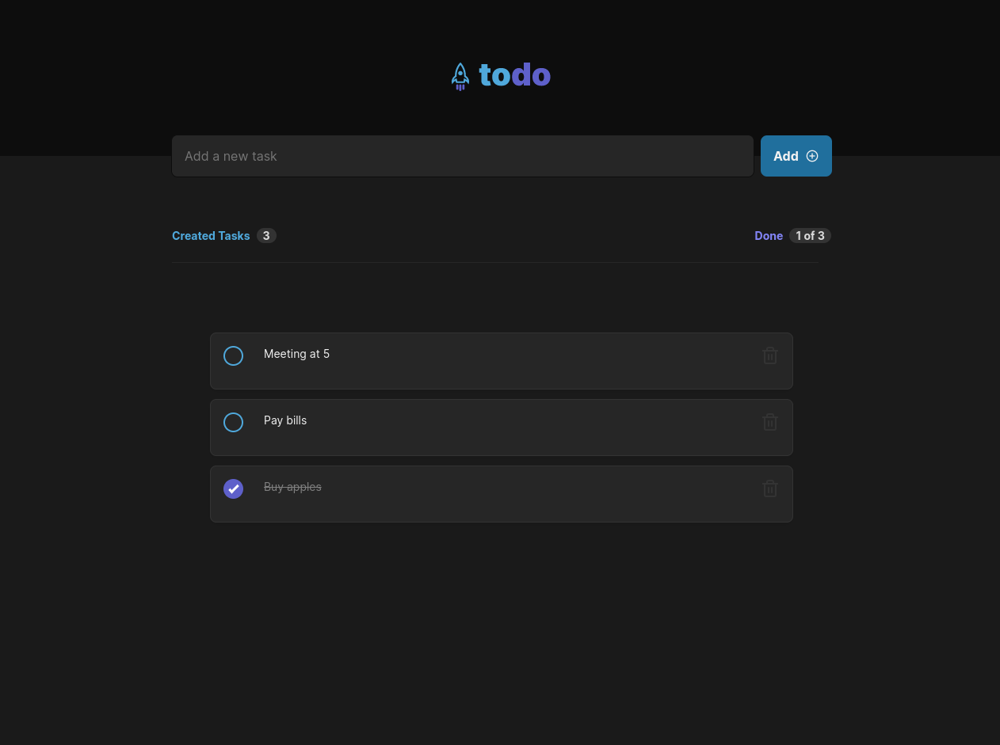

<p align="center">
  <a href="" rel="noopener">
 </a>
</p>

<h1 align="center">
   <a href="#"> Todo  </a>
</h1>

<h3 align="center">
All tasks are todo!
</h3>

<div align="center">

[]()
[](https://github.com/arubesu/todo/issues)
[](https://github.com/arubesu/todo/pulls)
[](/LICENSE)

</div>

---

<p align="center"> 
All tasks are todo!
    <br> 
</p>

## 📝 Table of Contents

- [📝 Table of Contents](#-table-of-contents)
- [🧐 About ](#-about-)
- [🎴 Layout](#-layout)
- [🏁 Getting Started ](#-getting-started-)
  - [Prerequisites](#prerequisites)
  - [Installing](#installing)
- [⛏️ Built Using ](#️-built-using-)
- [🤝 How to contribute](#-how-to-contribute)
- [🎉 Acknowledgements ](#-acknowledgements-)

## 🧐 About <a name = "about"></a>

A simple react project of a beautiful todo tasks 

## 🎴 Layout

The application layout is available on Figma:

<a href="https://www.figma.com/file/iOEYjaGA3l6GoSVkf4AoV4/ToDo-List-(Copy)?node-id=0%3A1&t=f2YyeNqJbQegqShi-0">
  
</a>

 

## 🏁 Getting Started <a name = "getting_started"></a>

These instructions will get you a copy of the project up and running on your local machine for development and testing purposes. 

### Prerequisites
Before you begin, you will need to have the following tools installed on your machine: [Git](https://git-scm.com). In addition, it is good to have an editor to work with the code like [VSCode](https://code.visualstudio.com/).

``` bash
# Clone this repository
git clone git@github.com:arubesu/todo.git

# Access the project folder cmd/terminal
cd todo

```

---

### Installing


```bash
# install the dependencies
yarn install


# Run the application in development mode
yarn dev
```

---

## ⛏️ Built Using <a name = "built_using"></a>

- [React](https://reactjs.org/) 
- [Next js](nextjs.org/) 
- [Typescript](https://www.typescriptlang.org) 
---
## 🤝 How to contribute

1. Fork the project.
2. Create a new branch with your changes: `git checkout -b my-feature`
3. Save your changes and create a commit message telling you what you did: `git commit -m" feature: My new feature "`
4. Submit your changes: `git push origin my-feature`
> If you have any questions check this [guide on how to contribute](https://github.com/firstcontributions/first-contributions)

---

## 🎉 Acknowledgements <a name = "acknowledgement"></a>

- References: Rocketseat bootcamp 

Made with ❤️  by Bruno Souza 👋🏽 [Get in Touch!](https://www.linkedin.com/in/bruno-a-souza/)